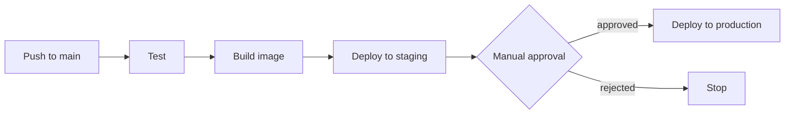
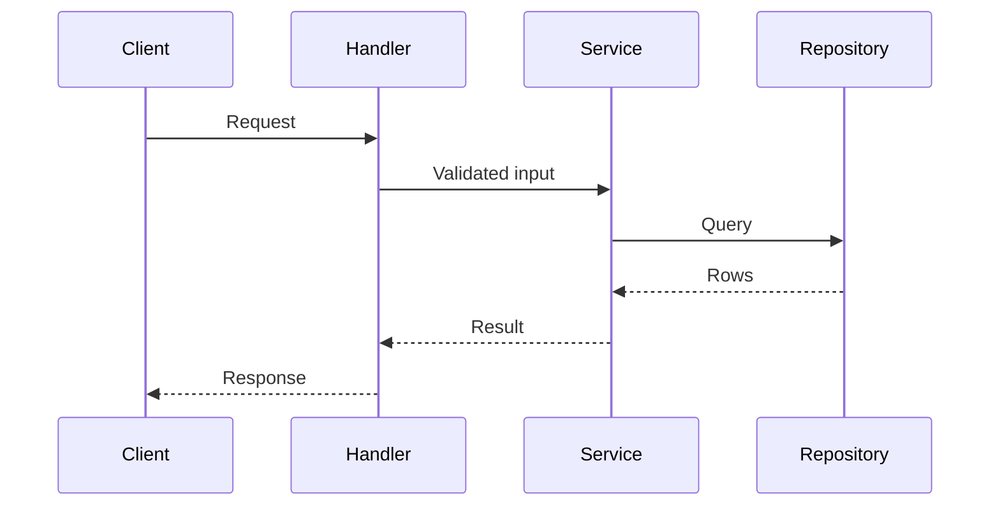
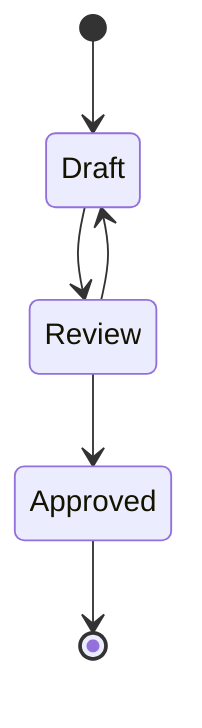
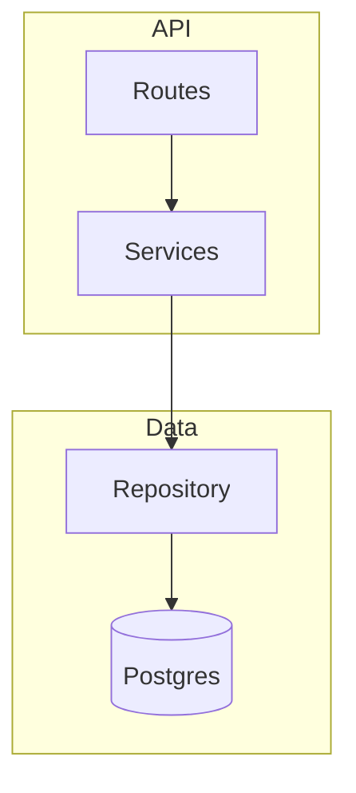
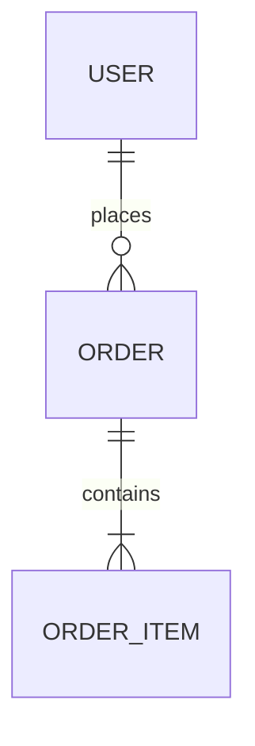

# Diagram Patterns

Starting shapes for common flows. Replace the generic names with the real ones from the repo. Quote labels that contain punctuation.

## CI/CD Pipeline (Flowchart)

## Request Flow (Sequence)

## Lifecycle (State)

## Module Relations (Flowchart With Groups)

## Data Relations (ER)

